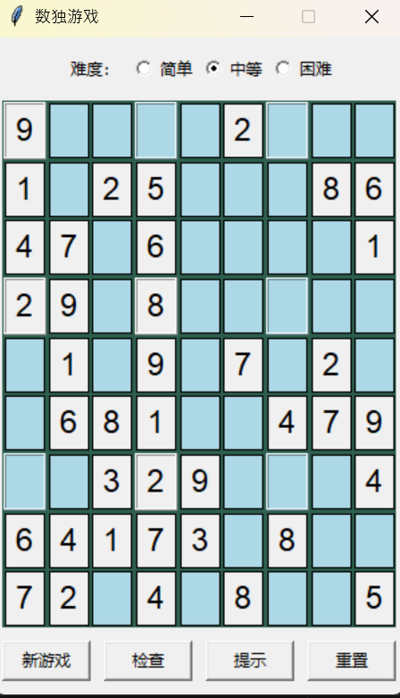

# 數獨游戲 (Sudoku Game)

一個使用 python Tkinter 開發的經典數獨游戲，支持三種難度級別（簡單、中等、困難），具有完整的數獨生成和求解邏輯



## 功能特性

-  圖形化界面，基于 Tkinter 原生庫，無需額外安裝
-  自動生成具有唯一解的完整數獨九宮格
-  三種難度級別：簡單（挖去30-35個洞）、中等（挖去40-45個洞）、困難（挖去50-55個洞）
-   輸入驗證（僅允許填入1-9數字）
-  一鍵檢查答案，錯誤格子高亮顯示
-  提示功能，自動填入正確數字
-  重置謎題，恢復初始狀態

## 環境要求

- pyton 3.6 或更高版本
- Tkinter（python 標準庫，通常隨python 一起安裝，無需另外安裝）

## 安裝與運行

1. **克隆倉庫**
   ```bash
   git clone https://github.com/caihongni/sudoku_game.git

2. **運行游戲**

   cd gui_version
   
   python main.py
